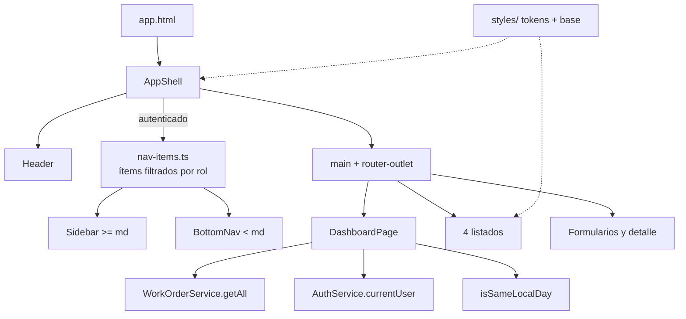
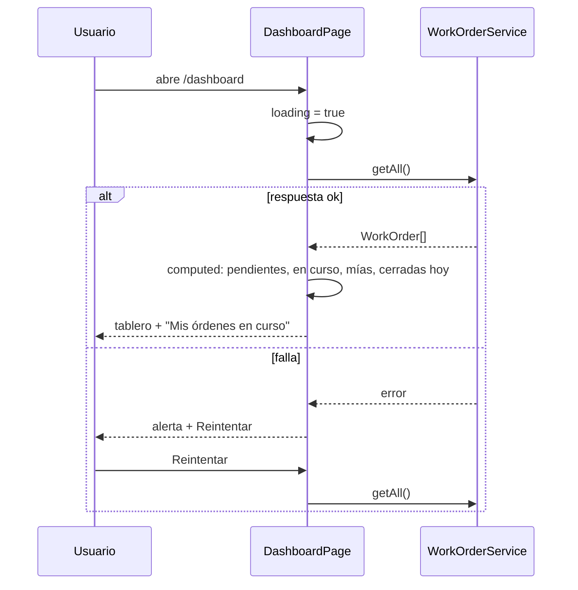

# Spec 014 — Diseño

## 1. Dirección visual: "Tablero de turno"

Referencia: la pizarra de turno de un jefe de mantenimiento. Se lee de un
vistazo, de pie y con una mano. Una sola familia tipográfica, bordes finos,
sin sombras, y un único momento memorable: el tablero del dashboard.

**Lo que se evita a propósito:** eyebrows en mayúsculas, fuente mono en etiquetas,
flechas en botones, tarjetas idénticas con sombra, animaciones de entrada,
hover con elevación. El único movimiento es el que responde a una acción
(toast, modal).

### Tokens (custom properties en `:root`, `themes/_default.scss`)

| Token                   | Hex                                       | Uso                                                          |
| ----------------------- | ----------------------------------------- | ------------------------------------------------------------ |
| `--color-chrome`        | `#0B3B3C`                                 | header, sidebar, barra inferior (texto blanco)               |
| `--color-bg`            | `#F4F7F7`                                 | fondo de página                                              |
| `--color-surface`       | `#FFFFFF`                                 | tarjetas, filas, inputs                                      |
| `--color-text`          | `#22313A`                                 | texto                                                        |
| `--color-text-muted`    | `#55666B`                                 | texto secundario                                             |
| `--color-primary`       | `#0F5F61`                                 | acciones primarias (marca actual, se conserva)               |
| `--color-signal`        | `#F2B705`                                 | prioridad alta y atención; **solo relleno** con texto oscuro |
| `--color-error`         | `#B42318`                                 | errores, cancelada                                           |
| `--color-border-subtle` | `#C9D3D4`                                 | borde decorativo de tarjetas y separadores                   |
| `--color-border`        | `#7A8C8C` (ya existía, spec 008b; 3.53:1) | borde de inputs, selects y botones outline                   |

### Contrastes medidos (REQ-1.5)

| Par                                     | Ratio    | Mínimo | Resultado                                               |
| --------------------------------------- | -------- | ------ | ------------------------------------------------------- |
| texto / fondo                           | 12.43    | 4.5    | ok                                                      |
| texto / superficie                      | 13.39    | 4.5    | ok                                                      |
| blanco / chrome                         | 12.32    | 4.5    | ok                                                      |
| primary / superficie y blanco / primary | 7.42     | 4.5    | ok                                                      |
| texto / signal (relleno)                | 7.36     | 4.5    | ok                                                      |
| error / superficie                      | 6.57     | 4.5    | ok                                                      |
| muted / superficie                      | 6.00     | 4.5    | ok                                                      |
| muted / fondo                           | 5.57     | 4.5    | ok                                                      |
| foco signal / chrome                    | 6.77     | 3      | ok                                                      |
| foco primary / fondo                    | 6.89     | 3      | ok                                                      |
| borde de control / superficie           | 4.36     | 3      | ok                                                      |
| **signal como texto / blanco**          | **1.82** | 4.5    | **falla: prohibido como texto**                         |
| **borde decorativo / superficie**       | **1.53** | 3      | **falla: solo decorativo, nunca identifica un control** |

Decisión derivada: dos tokens de borde, **reusando los nombres que el repo ya
tenía** en vez de crear `--color-border-control`. `--color-border` sigue siendo el
borde de control (un control que se distingue solo por su borde, como un input o
un select, lo usa) y `--color-border-subtle` es el decorativo, que pasa de
`#DFE7E7` a `#C9D3D4`. Redefinir `--color-border` como decorativo habría
debilitado en silencio todos los controles. La fila `borde de control` de la tabla
se mide con `#7A8C8C` (3.53:1), no con `#6B7C80`.

Desvío menor de la escala tipográfica: `--font-size-sm` se queda en 0.875rem en
vez de 0.8rem (12.8px es chico para leer de pie y con una mano).

### Tipografía

- Atkinson Hyperlegible Next 400/700, cargada desde Google Fonts en `index.html`
  con `preconnect` y `display=swap`. Respaldo: `system-ui, sans-serif`.
- Escala 1.25 sobre 1rem: 0.8 / 1 / 1.25 / 1.563 / 1.953rem. Interlineado 1.5.
- Descripciones con `max-width: 70ch`.
- Numerales tabulares (`font-variant-numeric: tabular-nums`) en códigos y conteos.

### Layout (mobile-first, alineado a la izquierda)

```
< 768px                      >= 768px
┌────────────────────┐       ┌──────┬─────────────────────┐
│ header (chrome)    │       │ side │ header (chrome)     │
├────────────────────┤       │ bar  ├─────────────────────┤
│ main               │       │ fija │ main                │
│                    │       │ 16rem│                     │
├────────────────────┤       └──────┴─────────────────────┘
│ acciones (sticky)  │
├────────────────────┤
│ barra inferior     │
└────────────────────┘
```

## 2. Arquitectura





## 3. Decisiones técnicas

### D1. Tablas → tarjetas solo con CSS (REQ-3.1, 3.2)

Se conserva el `<table>`. Bajo `md`, `tr` pasa a `display: grid` y `td` a
`display: block`, con `td::before { content: attr(data-label) }`. El `thead` se
oculta de forma visual (`visually-hidden`), no con `display: none`, para no
perderlo en lectores de pantalla.

- Cada `td` lleva `data-label`.
- `d-flex` sale de la celda de acciones, que pasa a envolver un
  `<div class="row-actions">`. Esto además arregla el `td` con `display:flex`.
- **Alternativa descartada:** render doble (tabla + lista de tarjetas) con
  `@if` por breakpoint. Duplica markup y rompería los tests que cuentan filas.

### D2. Franja de estado (REQ-3.3)

Modificador `row--<status>` en el `tr`, mapeando desde `STATUS_BADGE` de
`work-order.display.ts` para no duplicar la correspondencia estado → color. La
franja es un borde izquierdo de 4px; el texto del badge sigue presente, así que
el color nunca es el único canal.

### D3. Navegación compartida (REQ-2.1 a 2.4, 2.8)

- La lógica de permisos hoy vive en `sidebar.ts`
  (`canViewTechnicians`, `canManageTeams`, `canManageMachines`). Se extrae a
  `layout/nav-items.ts`, que devuelve un `computed` con
  `{ label, path }[]` filtrado por rol.
- `Sidebar` y el nuevo `BottomNav` consumen esa lista. Ninguno tiene permisos
  propios.
- `AppShell` renderiza ambos **solo si** `isAuthenticated()`. Se muestran u
  ocultan por CSS según el ancho, sin `@if` por breakpoint, para no depender de
  `matchMedia` en el código ni en los tests.
- Se elimina `sidebarOpen`, `openSidebar`, `closeSidebar`, el backdrop y la
  devolución de foco. El botón hamburguesa y sus `input`/`output` salen del
  `Header`.
- **Decisión:** la barra inferior muestra todos los ítems del rol (máximo 5:
  Inicio, Órdenes, Técnicos, Equipos, Máquinas). A 320px son 64px por ítem, por
  encima del mínimo de 44px.

### D4. Header (REQ-2.7, 6.2)

El título pasa de `<h2>` a `<p class="header__title">`; cada página conserva su
`h1`. Usuario y "Cerrar sesión" permanecen visibles en todos los anchos; a
320px el nombre se trunca con `text-overflow: ellipsis`.

### D5. Formularios (REQ-4.1 a 4.3)

- Los campos emparejados usan el `.form-row` que ya existe en `_form.scss`,
  reescrito mobile-first (1 columna; 2 desde `md`). Hoy ningún template lo usa.
- La barra de acciones es `position: sticky; bottom: calc(var(--bottom-nav-h) +
env(safe-area-inset-bottom))` bajo `md`. Desde `md` deja de ser sticky.
- No se toca el markup de errores (`aria-describedby`).

### D6. Detalle de orden (REQ-4.4, 4.5)

Se reordena el contenido de la tarjeta: número de orden (`id`) y badge de estado
arriba, luego el título, máquina › parte, prioridad, tipo, fecha de creación,
descripción y quién la tomó. La nota de cierre (autor, fecha, comentario) pasa a
ser su propio bloque `#closing-note` dentro de la tarjeta, cuando existe
`closingNote`. El pie "Estado: in-progress" (crudo, en inglés) se reemplaza por el
badge con `STATUS_LABELS`/`STATUS_BADGE`, como en el listado. Los datos ya están en
`WorkOrder`; no hay lógica nueva. Se conservan los ids `#machine-comment`,
`#taken-by` y `#closing-note` y los rótulos `Tipo:`, `Máquina / parte:`,
`Cerrada por:` de los que dependen los tests.

No se muestra el creador ni hay acciones en el detalle: `WorkOrder` no tiene
`createdBy` y la pantalla no tiene más acción que "Volver a Lista" (REQ-4.4
enmendado).

### D7. Dashboard (REQ-5)

- `dashboard-page.ts`: `signal` de `orders`, `loading` y `error`; `computed` de
  `pendientes`, `enCurso`, `mias`, `cerradasHoy`, `altasPendientes`.
- `isSameLocalDay(iso: string, now: Date): boolean` como función pura en
  `features/work-orders/models/`, testeable sin reloj real.
- `getAll()` trae todas las órdenes. Con JSON Server y el volumen del lab es
  aceptable. **Se anota como limitación:** con el backend real (Spring Boot)
  habría que pedir conteos agregados. No se sobre-diseña ahora.
- Reutiliza `STATUS_LABELS` / `PRIORITY_LABELS`, `Alert`, `Spinner` y
  `AuthService.currentUser`.
- Reintentar vuelve a llamar a `getAll()` sin recargar la página.

### D8. Movimiento y foco (REQ-1.4, 6.1)

Un único bloque global `@media (prefers-reduced-motion: reduce)` en `base/`,
que reemplaza la regla suelta del spinner. El foco usa `--color-primary` sobre
superficies claras y `--color-signal` sobre `--color-chrome`.

### D9. Media queries mobile-first (REQ-1.3)

`respond-below` se reemplaza por `respond-above` en todos los usos. Base = mobile.
Se elimina el mixin `respond-below` cuando ya no tenga usos, para que nadie
vuelva a escribir desktop-first por costumbre.

### D10. Presupuesto de estilos

Los estilos de listas, tarjetas y dashboard van en `src/styles/components/`
(globales), no en `styleUrl` por componente, para no acercarse al warning de
4 kB por componente.

## 4. Impacto en tests existentes

Se evita renombrar clases. Lo que sí cambia:

| Test                                  | Cambio                                                                                                                             |
| ------------------------------------- | ---------------------------------------------------------------------------------------------------------------------------------- |
| `app-shell.spec.ts`, `header.spec.ts` | Salen las pruebas del hamburguesa, el backdrop y el foco devuelto; entran las de barra inferior y de navegación ausente sin sesión |
| `sidebar` spec                        | Pasa a probar `nav-items` (ítems por rol) en vez de los `computed` propios                                                         |
| `app.spec.ts:43`                      | `main` sigue con clases `container p-lg sidebar-layout__content`; **no** se le agrega ninguna                                      |
| `work-order-detail.spec.ts`           | Ajustar `h2.card__header` si el reordenamiento lo mueve                                                                            |
| 4 specs de listas                     | Sin cambio esperado: `tbody tr`, `thead th` y `.btn--danger` se conservan                                                          |

## 5. Trazabilidad

| Requisito              | Lo cubre                                                                          |
| ---------------------- | --------------------------------------------------------------------------------- |
| REQ-1.1, 1.2           | Tokens y tipografía (§1), `index.html`, `themes/_default.scss`                    |
| REQ-1.3                | D9                                                                                |
| REQ-1.4                | D8                                                                                |
| REQ-1.5                | Tabla de contrastes (§1)                                                          |
| REQ-1.6                | Utilidad `justify-end` en `utilities/`                                            |
| REQ-2.1, 2.2, 2.3, 2.4 | D3 (`BottomNav`, `Sidebar`, `nav-items`)                                          |
| REQ-2.5                | `main` con `padding-bottom` de la barra + `env(safe-area-inset-bottom)` bajo `md` |
| REQ-2.6                | Verificación manual a 320px (sin `overflow-x`)                                    |
| REQ-2.7                | D4                                                                                |
| REQ-2.8                | D3 (render solo si `isAuthenticated()`)                                           |
| REQ-3.1, 3.2, 3.4      | D1                                                                                |
| REQ-3.3                | D2                                                                                |
| REQ-3.5                | Sin cambios de lógica; solo CSS                                                   |
| REQ-3.6                | Filtros con `flex-wrap` mobile-first en `_form.scss`                              |
| REQ-4.1, 4.2, 4.3      | D5                                                                                |
| REQ-4.4, 4.5           | D6                                                                                |
| REQ-5.1 a 5.10         | D7                                                                                |
| REQ-6.1                | D8                                                                                |
| REQ-6.2                | D4                                                                                |
| REQ-6.3                | `skip-link` se conserva; `main` con `scroll-margin` para la barra                 |

**Componentes sin requisito:** ninguno. `nav-items.ts` es la extracción de
D3 (REQ-2) y no agrega comportamiento.

## 6. Auto-revisión

- Los 6 grupos de requisitos tienen al menos un componente o decisión que los
  cubre; REQ-2.6 y 3.6 se verifican a mano porque son propiedades de render, no
  de lógica.
- REQ-5.10 y REQ-2.8 nacieron en este diseño; ya están en `requirements.md`.
- Riesgo abierto: `getAll()` no escala (D7). Aceptado y anotado.
