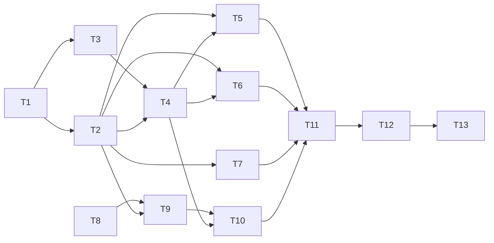

# Spec 014 — Tareas

Convenciones:

- Cada tarea termina con `pnpm test` en verde (el hook de Husky lo corre en cada commit) y un commit propio.
- "Verificación manual" = `pnpm start` + JSON Server, en Chrome a 320, 375, 768 y 1280px.
- Las tareas sin dependencia mutua se marcan como paralelizables.
- Si aparece algo no contemplado: parar, actualizar `requirements.md` → `design.md` → esta lista, y seguir.

## Mapa de dependencias

Paralelizables: T2 ∥ T3, T5 ∥ T6 ∥ T7, y T8 en cualquier momento (no depende de nada).

## Obligatorias

- [x] **T1. Base: tokens, fuente, mixins, movimiento**
  - Cubre: REQ-1.1, 1.2, 1.4, 1.6.
  - Depende de: nada.
  - Hacer: tokens de color, espaciado, escala tipográfica y radios como custom properties en `themes/_default.scss` (incluye `--color-chrome`, `--color-signal`, `--color-border`, `--color-border-control`, `--bottom-nav-h`); Atkinson Hyperlegible Next en `index.html` con `preconnect` y `display=swap`; `base/_typography.scss` con escala 1.25 y `tabular-nums`; bloque global `prefers-reduced-motion` en `base/` (reemplaza la regla suelta del spinner); utilidad `justify-end`; agregar `respond-above` sin tocar aún los usos de `respond-below`.
  - Verifica: test de una utilidad/tokens si aplica (al menos que `justify-end` exista: búsqueda en `src/styles`); `pnpm test` verde; `pnpm ng build` sin errores ni warnings de presupuesto; manual: la fuente carga y el texto ya no es Arial.

- [ ] **T2. Componentes globales con los tokens nuevos**
  - Cubre: REQ-1.5, REQ-6.1.
  - Depende de: T1. Paralelizable con T3.
  - Hacer: restilizar `btn`, `form`, `badge`, `alert`, `toast`, `modal`, `pagination`, `spinner`, `table`, `card` en `src/styles/components/`. Sin renombrar clases. Bordes de control con `--color-border-control`; foco de 3:1 o más (primary sobre claro, signal sobre chrome); botones `md`/`lg` de 44px mínimo de alto en mobile; sin sombras ni hover con elevación.
  - Verifica: todos los specs existentes pasan sin tocarlos (`badge.spec`, `alert.spec`, `modal.spec`, etc.); manual: recorrer con Tab un formulario y un modal, ver el foco; los pares de color usados están en la tabla de `design.md` §1.

- [x] **T3. Extraer `nav-items`**
  - Cubre: REQ-2.1 (qué secciones), base de REQ-2.8.
  - Depende de: T1 no es necesaria; se puede hacer primero. Paralelizable con T2.
  - Hacer: crear `layout/nav-items.ts` con los ítems (Inicio, Órdenes, Técnicos, Equipos, Máquinas) filtrados por `canViewTechnicians`, `canManageTeams`, `canManageMachines` desde `AuthService.currentUser()`. `Sidebar` pasa a consumirlo.
  - Verifica: tests nuevos de `nav-items` por rol (un caso por cada rol de 013b: los ítems visibles coinciden con los permisos); el spec del sidebar sigue pasando con los mismos ítems.

- [ ] **T4. Shell: barra inferior, sidebar fija y header**
  - Cubre: REQ-2.1 a 2.5, 2.7, 2.8, REQ-6.2, 6.3.
  - Depende de: T2, T3.
  - Hacer:
    - Crear `layout/bottom-nav/` (mismo `nav-items`, `routerLinkActive` + `ariaCurrentWhenActive="page"`, indicador visual que no sea solo color, objetivos de 44×44px).
    - `AppShell` renderiza `Sidebar` y `BottomNav` solo si `isAuthenticated()`; CSS mobile-first decide cuál se ve.
    - Quitar `sidebarOpen`, `openSidebar`, `closeSidebar`, backdrop y devolución de foco.
    - `Header` sin hamburguesa (salen `sidebarOpen` y `viewSidebar`); título como `
`; nombre con `ellipsis` a 320px.
    - `main` con `padding-bottom` de la barra + `env(safe-area-inset-bottom)` bajo `md`; `scroll-margin` para el skip link.
    - No agregar clases a `main` (`app.spec.ts:43`).
  - Verifica: actualizar `app-shell.spec.ts` y `header.spec.ts`; tests nuevos: sin sesión no hay `nav`; con sesión hay barra inferior y sidebar en el DOM con los ítems del rol; el ítem activo tiene `aria-current="page"`; el header no contiene `h2`. Manual: a 375px barra inferior y contenido no tapado; a 1024px sidebar fija sin toggle; `/login` sin navegación.

- [ ] **T5. Listados como tarjetas**
  - Cubre: REQ-3.1 a 3.6.
  - Depende de: T2, T4. Paralelizable con T6 y T7.
  - Hacer:
    - CSS de reflow en `components/_table.scss` (mobile-first: tarjeta bajo `md`, tabla desde `md`; `thead` con `visually-hidden`).
    - En `work-orders-list`, `machines-list`, `technicians-list` y `teams-list`: `data-label` en cada `td`, acciones dentro de `
` (se quita `d-flex` del `td`).
    - Franja de estado `row--<status>` en las órdenes, derivada de `STATUS_BADGE`.
    - Buscador, filtros y "Nueva orden" con `flex-wrap`.
  - Verifica: los 4 specs de listas pasan (`tbody tr`, `thead th`, `.btn--danger`); tests nuevos: todo `td` tiene `data-label` no vacío; una orden `in-progress` lleva `row--in-progress` y mantiene su badge con texto; el estado vacío y el de error no cambian. Manual: a 320px ninguna lista produce scroll horizontal y los botones de acción miden 44px o más.

- [ ] **T6. Formularios**
  - Cubre: REQ-4.1, 4.2, 4.3.
  - Depende de: T2, T4. Paralelizable con T5 y T7.
  - Hacer: `.form-row` mobile-first (1 columna, 2 desde `md`) y usarlo en los campos emparejados (tipo/prioridad en órdenes; legajo/nombre u otros pares en técnicos y máquinas); barra de acciones `sticky` sobre la barra inferior bajo `md`, estática desde `md`. No tocar el markup de errores.
  - Verifica: specs de formularios existentes pasan (`form.spec`, `technician-form.spec`, `team-form.spec`, `work-order-create.spec`); test: los `aria-describedby` de errores siguen apuntando a un id existente. Manual: a 375px la barra de acciones no tapa ningún campo al hacer scroll hasta el final; a 1024px los pares van en dos columnas.

- [ ] **T7. Detalle de orden y nota de cierre**
  - Cubre: REQ-4.4, 4.5.
  - Depende de: T2. Paralelizable con T5 y T6.
  - Hacer: reordenar `work-order-detail` (código y estado, título, máquina › parte, prioridad/tipo/creador, descripción, acciones); bloque `closing-note` con autor, fecha y comentario cuando la orden está cerrada y tiene `closingNote`.
  - Verifica: ajustar `work-order-detail.spec.ts` si cambia `h2.card__header`; tests nuevos: orden cerrada muestra autor, fecha y comentario; orden pendiente no muestra el bloque; el orden de los elementos coincide con REQ-4.4.

- [ ] **T8. `isSameLocalDay`**
  - Cubre: REQ-5.4 (base).
  - Depende de: nada. Paralelizable con cualquiera.
  - Hacer: función pura `isSameLocalDay(iso: string, now: Date): boolean` en `features/work-orders/models/`.
  - Verifica: test con `it.each`: mismo día, día anterior, día siguiente, justo a las 23:59 y 00:00 locales, ISO inválido (devuelve `false`, no lanza).

- [ ] **T9. Dashboard: lógica y estados**
  - Cubre: REQ-5.1 a 5.8.
  - Depende de: T2, T8.
  - Hacer: `dashboard-page.ts` con `signal` de `orders`, `loading`, `error`; `computed` de pendientes, altas pendientes, en curso, mías, cerradas hoy; carga con `WorkOrderService.getAll()`; estados de carga (`role="status"`), error con `Alert` y "Reintentar", y vacío con enlace a pendientes; "Mis órdenes en curso" como enlaces al detalle.
  - Verifica: tests con `HttpTestingController`: conteos correctos con un set mixto de órdenes; "mías" filtra por `takenBy.id` del usuario actual; "cerradas hoy" excluye cerradas ayer; el estado de carga aparece antes de responder; error → alerta → "Reintentar" repite la solicitud y muestra los datos; usuario sin órdenes en curso ve el mensaje y el enlace.

- [ ] **T10. Dashboard: layout del tablero**
  - Cubre: REQ-5.9, 5.10.
  - Depende de: T9, T4.
  - Hacer: bajo `md`, fila de 3 celdas con cantidades y "Mis órdenes en curso" debajo; desde `md`, tres columnas con hasta 3 órdenes cada una, ordenadas por `createdAt` (Pendientes y En curso) o `closingNote.at` (Cerradas hoy) de más reciente a más antigua, como enlaces al detalle. Estilos globales (presupuesto).
  - Verifica: test: con 5 pendientes se renderizan 3, las más recientes primero; "Cerradas hoy" ordena por `closingNote.at`. Manual: captura a 375px y a 1280px; `pnpm ng build` sin warnings de presupuesto.

- [ ] **T11. Auditoría mobile-first final**
  - Cubre: REQ-1.3.
  - Depende de: T5, T6, T7, T10.
  - Hacer: reemplazar los `respond-below` restantes por `respond-above`; eliminar el mixin `respond-below` si quedó sin usos; revisar `layout/` y `components/`.
  - Verifica: `grep` de `max-width` dentro de `@media` y de `respond-below` en `src/styles` sin resultados (las `prefers-*` quedan); `pnpm test` y `pnpm ng build` verdes.

- [ ] **T12. Verificación manual transversal**
  - Cubre: REQ-2.5, 2.6, 3.6, 6.1, 6.3.
  - Depende de: T11.
  - Hacer: recorrer cada pantalla a 320, 375, 768 y 1280px; teclado completo por el shell; skip link con la barra inferior; `prefers-reduced-motion` emulado; dashboard con datos, sin datos y con JSON Server apagado.
  - Verifica: lista de chequeo en `notes.md` con un sí/no por ítem y evidencia (qué pantalla, qué ancho). Cualquier "no" vuelve a la tarea que corresponda.

- [ ] **T13. Cierre de la spec**
  - Depende de: T12.
  - Hacer: recorrer cada criterio de `requirements.md` (REQ-1 a REQ-6) y marcar sí/no con una línea de evidencia en `notes.md`; actualizar el README donde describa la UI o la cobertura; correr `pnpm test` completo.
  - Verifica: `notes.md` con los 6 grupos de requisitos evaluados uno por uno. La spec no se da por cerrada por tener todas las tareas tildadas.

## Opcionales

- [ ] **O1. Documentar los tokens en el README** (tabla de colores y escala tipográfica). Depende de: T1.
- [ ] **O2. Skeleton de carga en el dashboard** en lugar del spinner global. Depende de: T9. Solo si el estado de carga de T9 se siente brusco en la verificación manual.

## Fuera de esta lista

Control segmentado de estado en el listado de órdenes: queda fuera de alcance (ver `requirements.md`).

## Trazabilidad requisito → tarea

| Requisito                   | Tareas  |
| --------------------------- | ------- |
| REQ-1.1, 1.2, 1.4, 1.6      | T1      |
| REQ-1.3                     | T1, T11 |
| REQ-1.5                     | T2      |
| REQ-2.1                     | T3, T4  |
| REQ-2.2, 2.3, 2.4, 2.7, 2.8 | T4      |
| REQ-2.5                     | T4, T12 |
| REQ-2.6                     | T12     |
| REQ-3.1 a 3.5               | T5      |
| REQ-3.6                     | T5, T12 |
| REQ-4.1 a 4.3               | T6      |
| REQ-4.4, 4.5                | T7      |
| REQ-5.1 a 5.3, 5.5 a 5.8    | T9      |
| REQ-5.4                     | T8, T9  |
| REQ-5.9, 5.10               | T10     |
| REQ-6.1                     | T2, T12 |
| REQ-6.2                     | T4      |
| REQ-6.3                     | T4, T12 |
