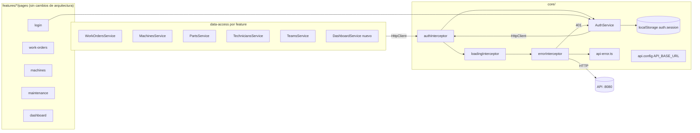
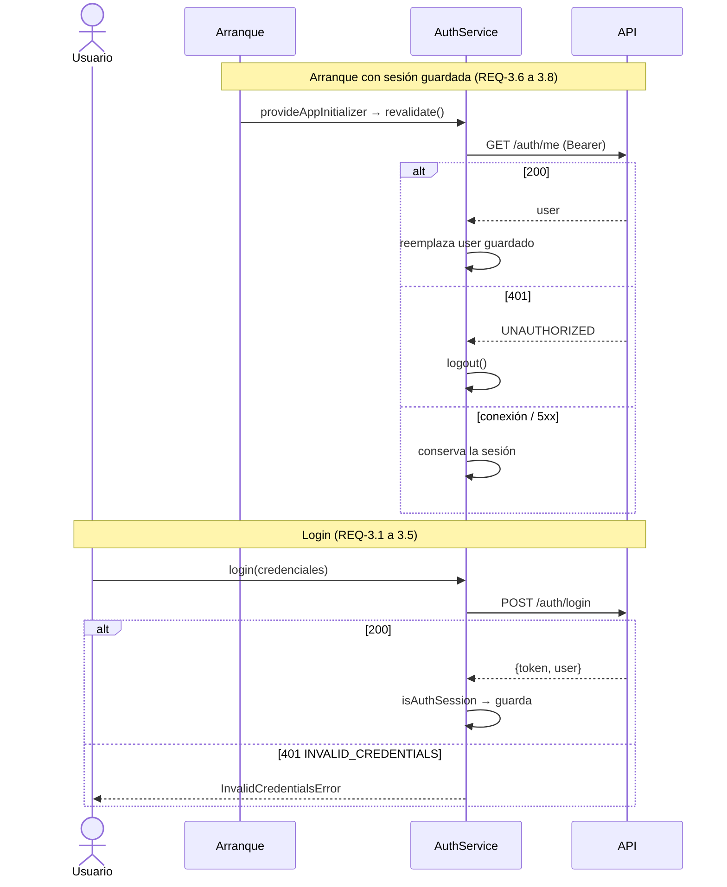
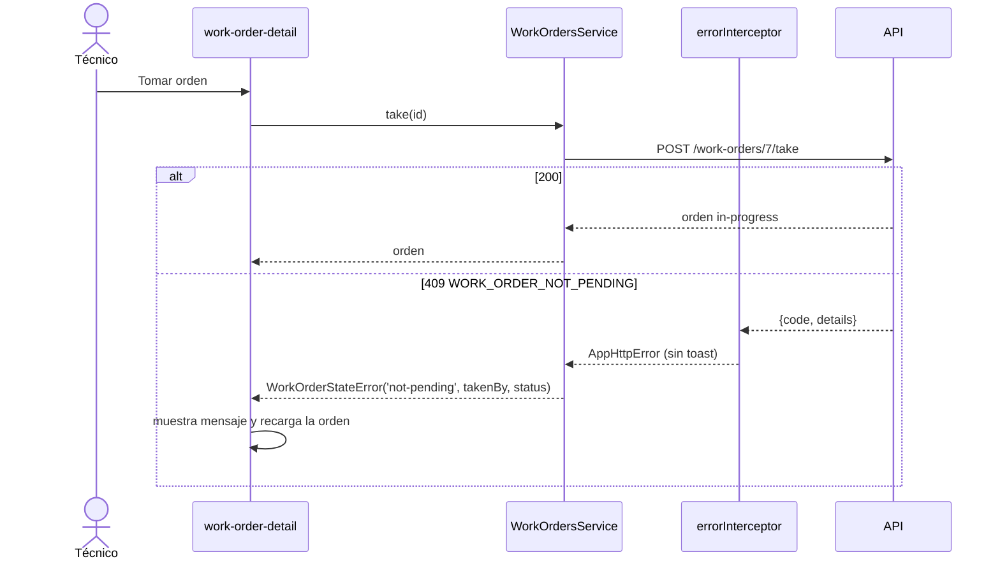
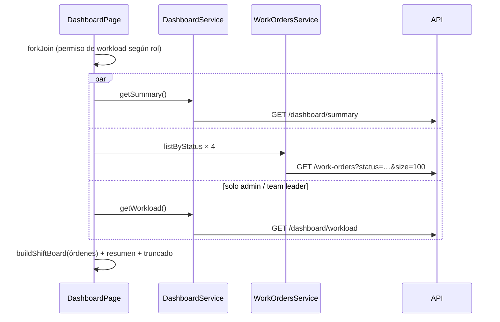

# Spec 018 — Diseño

Responde a `requirements.md` (aprobado). Principio: **cambia el origen de los datos, no la
arquitectura**. Las páginas, guards y el contrato público de `AuthService` se conservan;
los cambios viven en `core/` y en los `data-access` de cada feature.

## Preguntas abiertas resueltas (leídas en el código de la API)

| #   | Pregunta                        | Respuesta                                                                                                                                                         |
| --- | ------------------------------- | ----------------------------------------------------------------------------------------------------------------------------------------------------------------- |
| 1   | `code` de los `409` de técnicos | Baja bloqueada: `TECHNICIAN_IN_USE`. Legajo repetido: `DUPLICATE_LEGAJO`.                                                                                         |
| 2   | `size` por defecto y `title`    | `size` por defecto 10 (1–100). `title` es "contiene", sin distinguir mayúsculas; vacío no filtra. Página fuera de rango devuelve `data` vacío con totales reales. |
| 3   | `code` del `401`                | Login con credenciales malas: `INVALID_CREDENTIALS`. Token ausente o vencido: `UNAUTHORIZED`.                                                                     |
| 4   | Filtro por fecha de cierre      | **No existe.** "Cerradas hoy" se calcula en el cliente (ver D-8 y riesgos).                                                                                       |

## Arquitectura

Cadena de interceptores final: `auth → loading → error` (se retira `mockDelay`).

## Decisiones

### D-1 Configuración (REQ-1)

`core/config/api.config.ts` pasa de `localhost:3000` a `http://localhost:8080`. Es una
constante única; todos los servicios derivan sus rutas de ella (hoy `WorkOrdersService`
tiene la URL escrita a mano: se corrige). El `authInterceptor` ya adjunta el token solo a
URLs que empiezan por `API_BASE_URL` (REQ-1.3), se mantiene y se le agrega un test.
_Descartado:_ archivos `environments/` y `fileReplacements`: no hay otro entorno todavía
y se agregan el día que haya despliegue (fuera de alcance).

### D-2 Errores (REQ-2)

- Nuevo `core/api/api-error.ts`: `ApiErrorBody {code, message, timestamp, path, details?}`
  y `readApiError(error): {code, message, details} | null` (valida el shape, nunca asume).
- `AppHttpError` (en `error.interceptor.ts`) suma `code: string | null` y
  `details: Record<string, unknown> | null`. Así los servicios mapean por `code`, no por
  texto.
- Mensajes: se usa el `message` de la API; sin cuerpo, los genéricos por status que ya
  existen (REQ-2.3). El `403` mantiene su texto fijo (REQ-2.4).
- **Toast vs. mensaje de página.** Hoy el interceptor muestra un toast por cualquier
  error. Con la API, un `409` o un `400` con `details` los traduce el servicio a un error
  de dominio y la página ya muestra su propio mensaje: dos avisos serían ruido. Por eso
  el interceptor **no muestra toast** en `409` ni en `400` con `details`, y los entrega
  con `code`/`details` (REQ-2.2, 2.6). El resto de los estados conserva su toast. Para
  esos dos casos REQ-2.1 se cumple en la página, con el `message` de la API como
  respaldo cuando el `code` no está mapeado.
- **401 (REQ-2.5):** el interceptor llama `AuthService.logout()` y navega a
  `loginUrlFor(router.url)` (ya existe). Se excluyen `POST /auth/login` (lo maneja el
  login) y `GET /auth/me` (lo maneja `AuthService`, D-3). Evita bucles: si ya no hay
  sesión, no hace nada.
- Se retiran los dos `console.log` (REQ-2.7).

### D-3 Sesión (REQ-3)

- `login()`: `POST /auth/login` → `AuthSession`. Se valida con el `isAuthSession` existente
  (REQ-3.4 y 3.5: un perfil inválido lanza `InvalidUserRecordError`). Un `AppHttpError`
  con `status 401` se traduce a `InvalidCredentialsError` (REQ-3.2); otros errores se
  propagan tal cual para que la página distinga conexión/servidor (REQ-3.3).
- Se mantiene el contrato público (REQ-3.10): `login`, `logout`, `session`,
  `currentUser`, `token`, `isAuthenticated`, `loginUrlFor`.
- **Validación al arrancar (REQ-3.6 a 3.8).** La sesión sigue restaurándose
  sincrónicamente desde `localStorage` (los guards la necesitan sin esperar). Un
  `provideAppInitializer` llama a `AuthService.revalidate()`, que solo actúa si hay sesión:
  - `200` → reemplaza el `user` guardado por el recibido (si no es un `AuthUser` válido,
    descarta la sesión) y conserva el token.
  - `401` → `logout()` silencioso.
  - conexión o `5xx` → conserva la sesión y no bloquea el arranque.
    Como el 401 de `/auth/me` está excluido del interceptor (D-2), no hay redirección doble;
    los guards redirigen en la primera navegación.
- Se eliminan de `auth.model.ts` los tipos que solo servían al mock (`UserRecord`,
  `StaffUserRecord`, `TechnicianUserRecord`, `toAuthUser`) y se borran
  `technician-directory.ts` y `users.service.ts` con sus specs (REQ-4.8). `isLegajo` y
  `LEGAJO_PATTERN` se quedan (validación de formularios).
- _Descartado:_ revalidar con `/auth/me` en cada navegación (tráfico sin pedido) y
  refresh token (fuera de alcance; el TTL de 60 min termina en un `401` → login).

### D-4 Técnicos y equipos (REQ-4, REQ-5)

- `TechniciansService`: `getAll` → `GET /technicians`; `getByLegajo` → `GET /technicians/{legajo}`;
  `create`/`update`/`delete` por legajo. Desaparecen la búsqueda previa del técnico por
  legajo, el chequeo de unicidad y la consulta "¿tiene usuario?". `DUPLICATE_LEGAJO` →
  error de dominio de legajo repetido (campo legajo, REQ-4.7); `TECHNICIAN_IN_USE` → mensaje
  de baja bloqueada con el texto de la API (REQ-4.6). `404` → los errores "no existe" actuales.
- `TeamsService`: rutas `/teams`; `PUT` sin `id` en el cuerpo. `400 UNKNOWN_TECHNICIAN` →
  error de dominio que la página muestra sin vaciar el formulario (REQ-5.6).
- La `technicians-list` deja de depender de `UsersService`.

### D-5 Máquinas y partes (REQ-6, REQ-7)

- `MachinesService`: `create`/`update`/`delete` van directo; se eliminan `getAll()`
  previo, `isCodeTaken` y la consulta de partes antes de borrar. `409
DUPLICATE_MACHINE_CODE` → `DuplicateMachineCodeError`; `409 MACHINE_HAS_PARTS` →
  `MachineHasPartsError` (el `partCount` sale del modelo `Machine`, no del `409`). El
  modelo `Machine` suma `partCount: number`.
- La normalización del código (recorte y mayúsculas) y su patrón se **mantienen en el
  cliente** como validación de formulario; el servidor es la autoridad.
- `PartsService`: `getByMachine(id)` → `GET /machines/{id}/parts`; `create(machineId, {name,
parentId})` → `POST /machines/{id}/parts`; `rename` → `PATCH /parts/{id}`; `delete` →
  `DELETE /parts/{id}`. Se elimina `getAll()` global y las verificaciones de padre/máquina.
  `PART_HAS_CHILDREN`, `PARENT_PART_NOT_FOUND` y `PARENT_PART_OTHER_MACHINE` →
  `PartHasChildrenError` / `ParentPartNotFoundError`, que ya existen.
- `404` al listar partes → `MachineNotFoundError`.

### D-6 Órdenes: lectura, alta, edición, baja (REQ-8, REQ-9)

- **Paginación.** `PaginatedResponse<T>` pasa a `{data, page, size, totalItems, totalPages}`.
  `WorkOrdersCriteria` conserva `page`/`perPage` internos y el servicio los envía como
  `page`/`size`. Se retiran `getAll()` y `getPaginated()`; todo pasa por `search()`
  (más el nuevo uso del dashboard, D-8). Las páginas que leían `pages`/`items` pasan a
  `totalPages`/`totalItems`.
- **Alta.** `WorkOrderCreateRequest` pierde `breadcrumb` en su `machineRef`
  (`WorkOrderMachineRefInput {machineId, partId, comment}`); el servicio deja de agregar
  `status` y `createdAt`. `WorkOrder.machineRef` (respuesta) sigue con `breadcrumb`.
  `400 MACHINE_NOT_FOUND / PART_NOT_FOUND / PART_OTHER_MACHINE` → error de dominio que la
  página muestra en el selector; `VALIDATION_ERROR` → errores por campo desde `details`.
- **Edición.** Nuevo `WorkOrderUpdateRequest {title, description, priority}`;
  `update(id, request)` ya no recibe la orden completa. La página de edición envía solo
  esos campos.
- **Baja** sin cambios de lógica; `404` y `403` los resuelve la página (REQ-9.7, 9.8).
- `getById` y `WorkOrderLoadError` se mantienen (`404` → not-found, resto → connection).
- Fechas: `createdAt` y compañía ya son `string` ISO; se mantienen y `work-order.dates.ts`
  sigue siendo el único lugar que las compara.

### D-7 Tomar, cerrar, liberar (REQ-10)

- `take(id)`, `close(id, outcome, comment)` y `release(id)` pasan a `POST` y **ya no
  reciben ni envían** dueño o autor (REQ-10.8). Se eliminan `readFresh` y las
  comprobaciones de estado/dueño del cliente.
- `close` conserva la validación de `isValidClosingComment` previa al request (REQ-10.4) y
  el `trim`.
- **Traducción de `409`** (REQ-10.5): `WORK_ORDER_NOT_PENDING → 'not-pending'`,
  `WORK_ORDER_NOT_IN_PROGRESS → 'not-in-progress'`, `WORK_ORDER_TAKEN_BY_OTHER →
'taken-by-other'`. `details.status`, `takenById`, `takenByName` alimentan
  `WorkOrderStateError`. Como el `409` no trae `takenBy.at`, el campo `takenBy` del error
  pasa de `WorkOrderTaker` a `Pick<WorkOrderTaker, 'id' | 'name'>`; los mensajes de la spec
  013d no cambian.
- **Recarga tras `409` (REQ-10.6):** la hace la página (ya recarga hoy al recibir
  `WorkOrderStateError`); se verifica con un test por transición.
- `403` en `take` (equipo no habilitado) llega por el camino genérico del interceptor.

### D-8 Dashboard (REQ-11)

- Nuevo `features/dashboard/data-access/dashboard.service.ts`:
  `getSummary()` → `GET /dashboard/summary` y `getWorkload()` → `GET /dashboard/workload`,
  con modelos tipados (`DashboardSummary`, `WorkloadItem`) en `models/`.
- Las listas salen de `WorkOrdersService.listByStatus(status)`: `GET /work-orders?status=…&size=100`
  devolviendo la `PaginatedResponse` (se necesita `totalItems` para el aviso de truncado).
- `DashboardPage.load()` hace un `forkJoin` de: summary, `listByStatus` de los cuatro
  estados y, solo si `canViewWorkload(user)`, el workload. Cualquier falla → el estado de
  error con "Reintentar" (REQ-11.7). El permiso vive en
  `dashboard/models/dashboard.permissions.ts` (administrador y team leader), como las
  demás políticas.
- `buildShiftBoard` **se reutiliza sin cambios**: recibe la concatenación de las cuatro
  listas. Esto conserva sus tests y la regla "de hoy" por `closingNote.at`.
- Truncado (REQ-11.3): por estado, `truncated = totalItems > data.length`; la UI muestra
  "Mostrando las primeras N de M".
- Cifras nuevas (REQ-11.1, 11.6): una franja "Resumen" con `total`, `open`, cerradas en
  el período (30 días) y promedio de resolución (`null` → "Sin datos"). La sección
  "Carga de trabajo" solo se renderiza si el usuario tiene permiso (REQ-11.4, 11.5).
- **Riesgo conocido:** como no hay filtro por fecha, "cerradas hoy" se calcula sobre la
  primera página (100) de `completed` y `cancelled`. El orden por defecto del listado no
  está documentado; con más de 100 cerradas podría omitir alguna de hoy. Con el seed
  (9 y 2) no ocurre. Queda anotado en `notes.md` como pedido futuro a la API
  (`closedFrom` o equivalente); no se resuelve en esta spec.

### D-9 Retiro del mock y tests (REQ-12)

- Se borran: `mock-api.interceptor.ts`, `mock-delay.interceptor.ts`, `work-order.mock.ts`,
  `core/testing/in-memory-api(.spec).ts`, `db.json`, `db.seed.spec.ts`; del
  `package.json`, el script `api` y `json-server`; del `app.config.ts`, `mockDelayInterceptor`.
- Los 5 specs de integración que dependen del emulador (`machines-tree`,
  `technicians.service`, `work-order-closure`, `work-order-create`, y los de
  `machine-form`/`machine-parts` que lo importan) se reescriben con
  `HttpTestingController`: cada test afirma ruta, método, cuerpo y parámetros del
  contrato real. Esto es lo que reemplaza la protección que daba el emulador (el riesgo de
  "tests verdes con contrato falso" se mitiga con REQ-13, la verificación manual).
- `work-order.fixtures.ts` se alinea al shape de la API (ids string, `takenBy.at`,
  `closingNote`).
- `pnpm test` no necesita la API levantada (REQ-12.4).
- `README.md` y `CLAUDE.md` pasan a "Backend: API real", con pasos para levantarla y la
  tabla de usuarios de desarrollo.

### D-10 Verificación real (REQ-13)

Checklist manual contra la API con perfil `dev` (los cinco usuarios + flujo completo) y
resultado en `notes.md`. Incluye comprobar el `409` real de `take` repetido y el
`401` por token vencido (editando el token guardado).

## Flujos principales

## Trazabilidad

| Requisito              | Lo cubre                                                                     |
| ---------------------- | ---------------------------------------------------------------------------- |
| REQ-1.1, 1.2           | D-1: `api.config.ts` y servicios derivados de `API_BASE_URL`                 |
| REQ-1.3                | `authInterceptor` (existente) + test nuevo                                   |
| REQ-2.1–2.4, 2.6       | D-2: `api-error.ts`, `errorInterceptor`, `AppHttpError.code/details`         |
| REQ-2.5                | D-2: 401 → `logout()` + `loginUrlFor`                                        |
| REQ-2.7                | D-2: retiro de `console.log`                                                 |
| REQ-3.1–3.5, 3.9, 3.10 | D-3: `AuthService.login/logout`                                              |
| REQ-3.6–3.8            | D-3: `revalidate()` + `provideAppInitializer`                                |
| REQ-4.1–4.7            | D-4: `TechniciansService` por legajo                                         |
| REQ-4.8                | D-3 y D-4: borrado de `TechnicianDirectory`, `UsersService`                  |
| REQ-5.1–5.7            | D-4: `TeamsService`                                                          |
| REQ-6.1–6.7            | D-5: `MachinesService`                                                       |
| REQ-7.1–7.7            | D-5: `PartsService`                                                          |
| REQ-8.1–8.8            | D-6: `search()`, `getById`, nueva paginación                                 |
| REQ-9.1–9.8            | D-6: create/update/delete y errores de dominio                               |
| REQ-10.1–10.8          | D-7: `take/close/release` y traducción de `409`                              |
| REQ-11.1–11.7          | D-8: `DashboardService`, `listByStatus`, `forkJoin`, `dashboard.permissions` |
| REQ-12.1–12.6          | D-9: retiro del mock, tests reescritos, docs                                 |
| REQ-13.1–13.3          | D-10: checklist manual + `notes.md`                                          |

**Decisiones técnicas sin requisito directo:** el `provideAppInitializer` y la supresión
de toast en `409`/`400` con `details` (D-2, D-3) son consecuencia de REQ-3.6 y REQ-2.2/2.6
y evitan doble aviso; `listByStatus` (D-8) es el medio para REQ-11.2.

## Alternativas descartadas

- Cliente generado desde OpenAPI: añade tooling y tipos que duplican los modelos que ya
  existen y tienen guards de runtime.
- Interceptor global que traduzca `409` a errores de dominio: mezcla conocimiento de
  órdenes, máquinas y técnicos en `core/`; la traducción queda en cada servicio.
- Mantener JSON Server como modo offline: duplica el contrato (paginación, rutas, ids).
- Caché de listados: la API calcula en el momento y nadie lo pidió.
