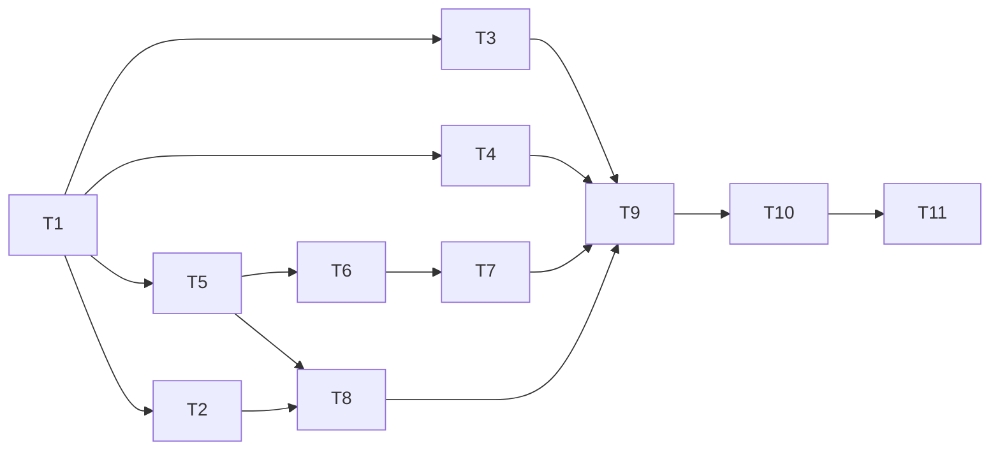

# Spec 018 — Tareas

Convenciones: `[ ]` pendiente, `[x]` hecha. Cada tarea deja `pnpm test`, `pnpm lint` y
`pnpm build` en verde antes de commitear (el pre-commit corre `pnpm test`). Un commit por
tarea: `tipo(alcance): … (spec 018, Tn)`. Ninguna tarea necesita la API levantada, salvo T11.

Mientras no llegue T9 conviven los emuladores de test y la API real: los tests existentes
que usan `in-memory-api` se reescriben en la tarea de su capa, no antes.

## Mapa de dependencias

T3, T4 y T5 son independientes entre sí. T6→T7 comparten `WorkOrdersService`, van en serie.

## Obligatorias

- [x] **T1 — Base: configuración y errores** · REQ-1, REQ-2 · depende de: —
  - `api.config.ts` → `http://localhost:8080`; `WorkOrdersService` deriva su URL de `API_BASE_URL`.
  - `core/api/api-error.ts` (`readApiError`); `AppHttpError` suma `code` y `details`.
  - `errorInterceptor`: sin toast en `409` ni en `400` con `details`; `403` con texto fijo;
    `401` → `logout()` + `loginUrlFor(router.url)`, excluyendo `/auth/login` y `/auth/me`;
    retiro de los `console.log`.
  - **Verifica:** `error.interceptor.spec.ts` (cuerpo `{code,message}`, `400` con `details`,
    `409` sin toast y con `code`, `403`, `401` con redirección y con exclusión de
    login/me, sin cuerpo con `0`/`502`, no-HTTP); `auth.interceptor.spec.ts` (URL ajena no
    recibe header); `api-error.spec.ts` (shape inválido → `null`).

- [x] **T2 — Sesión con JWT** · REQ-3 · depende de: T1
  - `AuthService.login()` con `POST /auth/login` y `isAuthSession`; `401` →
    `InvalidCredentialsError`; perfil inválido → `InvalidUserRecordError`.
  - `revalidate()` (`GET /auth/me`: `200` reemplaza el `user`, `401` descarta, conexión/`5xx`
    conserva) y `provideAppInitializer` en `app.config.ts`.
  - La página de login sigue distinguiendo credenciales, perfil y conexión.
  - **Verifica:** `auth.service.spec.ts` y `login-page.spec.ts` reescritos con
    `HttpTestingController` (login ok de técnico y de no técnico, `401`, técnico sin
    `legajo`, no técnico con `specialty`, error de red, `5xx`, revalidación en sus tres
    ramas, `logout` borra el storage, el contrato público no cambió); `app.config.spec.ts`
    comprueba el initializer.
  - No borra `TechnicianDirectory` ni `UsersService` todavía (los usan técnicos, T3).

- [x] **T3 — Técnicos y equipos** · REQ-4, REQ-5 · depende de: T1
  - `TechniciansService` y `TeamsService` a las rutas nuevas, por legajo; mapeo de
    `DUPLICATE_LEGAJO`, `TECHNICIAN_IN_USE`, `UNKNOWN_TECHNICIAN` y `404`.
  - Borrar `technician-directory.ts`, `users.service.ts` y sus specs; `technicians-list` sin
    `UsersService`; limpiar `auth.model.ts` (`UserRecord`, `StaffUserRecord`,
    `TechnicianUserRecord`, `toAuthUser`).
  - **Verifica:** specs de ambos servicios con `HttpTestingController` (método, URL, cuerpo;
    `PUT /teams/{id}` sin `id` en el cuerpo); `technicians-list.spec`, `technician-form.spec`
    y `team-form.spec` cubren `409` con baja bloqueada (el técnico sigue en la lista),
    legajo repetido en el campo y `UNKNOWN_TECHNICIAN` conservando la selección;
    `grep -r "TechnicianDirectory\|UsersService" src` sin resultados; reescritura de
    `technicians.service.integration.spec.ts`.

- [x] **T4 — Máquinas y partes** · REQ-6, REQ-7 · depende de: T1
  - `Machine.partCount`; `MachinesService` directo (sin `getAll` previo ni consulta de
    partes); `PartsService` por `/machines/{id}/parts` y `/parts/{id}`; mapeo de
    `DUPLICATE_MACHINE_CODE`, `MACHINE_HAS_PARTS`, `PART_HAS_CHILDREN`,
    `PARENT_PART_NOT_FOUND`, `PARENT_PART_OTHER_MACHINE` y `404`. Listado muestra `partCount`.
  - **Verifica:** specs de `machines.service`, `parts.service`, `machines-list`,
    `machine-form`, `machine-parts`; el alta de máquina emite un solo `POST` (sin `GET`
    previo); `PATCH` lleva solo `{name}`; `PARENT_PART_*` recargan el árbol;
    `machines-tree.integration.spec.ts` reescrito sin emulador.

- [ ] **T5 — Órdenes: paginación y lectura** · REQ-8 · depende de: T1
  - `PaginatedResponse` nuevo; `search()` envía `page`, `size`, `title`, `status`, `priority`
    (omite vacíos); `listByStatus(status)`; retiro de `getPaginated()`; la lista usa
    `totalPages` y `totalItems`.
  - **Verifica:** `work-order.service.spec.ts` (parámetros exactos, sin `status` si vacío,
    `getById` `404` vs conexión), `work-orders-list.spec.ts` (paginación, vacío, error con
    "Reintentar"), `work-order-loader.spec.ts`, `work-order.model.spec.ts`.
  - _Nota:_ `getAll()` se conserva hasta T8 (es el único consumidor: el dashboard). Entre
    T5 y T8 el tablero no funciona contra la API real (el listado ya viene paginado); es
    aceptable porque nada se despliega hasta T11 y los tests no dependen de eso.

- [ ] **T6 — Órdenes: alta, edición y baja** · REQ-9 · depende de: T5
  - `WorkOrderMachineRefInput`, `WorkOrderUpdateRequest`; `create` sin `status`/`createdAt`;
    `update(id, request)`; página de edición envía `{title, description, priority}`;
    errores `MACHINE_NOT_FOUND`/`PART_NOT_FOUND`/`PART_OTHER_MACHINE` en el selector y
    `details` por campo; `403` y `404` conservan el estado de la pantalla.
  - Alinear `work-order.fixtures.ts` al shape de la API.
  - **Verifica:** specs del servicio (cuerpo exacto del `POST` y del `PUT`),
    `work-order-create.spec`, `work-order-edit.spec`, `work-order-detail.spec` (baja);
    `work-order-create.integration.spec.ts` reescrito sin emulador.

- [ ] **T7 — Órdenes: tomar, cerrar, liberar** · REQ-10 · depende de: T6
  - `take`/`close`/`release` por `POST` sin dueño ni autor en el cuerpo; retiro de
    `readFresh`; traducción de `409` a `WorkOrderStateError` con
    `takenBy: Pick<WorkOrderTaker,'id'|'name'>`; `close` valida 50–500 y recorta antes de
    enviar; la página recarga tras `409`.
  - **Verifica:** `work-order.service.spec.ts` (los tres `POST`, `close` con
    `{outcome, comment}` recortado, comentario corto/largo sin request, un test por cada
    `code` de `409`, `403` en `take`); `work-order-detail.spec` y `work-order-resolve.spec`
    (mensaje de la spec 013d y recarga); `work-order-closure.integration.spec.ts`
    reescrito sin emulador.

- [ ] **T8 — Dashboard** · REQ-11 · depende de: T2, T5
  - `DashboardService`, modelos, `dashboard.permissions.ts` (`canViewWorkload`);
    `DashboardPage.load()` con `forkJoin`; franja "Resumen" y sección "Carga de trabajo";
    aviso de truncado; `buildShiftBoard` intacto. Se borra `WorkOrdersService.getAll()`.
  - **Verifica:** `dashboard.service.spec`, `dashboard.permissions.spec`,
    `dashboard-page.spec` (administrador/team leader piden workload; técnico y producción
    no; `averageResolutionMinutes: null` → "Sin datos"; truncado con `totalItems > data.length`;
    fallo de cualquier lectura → error con "Reintentar"); `shift-board.spec` sin cambios.

- [ ] **T9 — Retiro del mock** · REQ-12.1–12.5 · depende de: T3, T4, T7, T8
  - Borrar `mock-api.interceptor.ts`, `mock-delay.interceptor.ts` (y su entrada en
    `app.config.ts`), `work-order.mock.ts`, `in-memory-api(.spec).ts`, `db.json`,
    `db.seed.spec.ts`; quitar el script `api` y `json-server` del `package.json` y
    actualizar el lockfile.
  - **Verifica:** `grep -rn "in-memory-api\|work-order.mock\|mock-api\|mock-delay\|db.json\|json-server" src package.json`
    sin resultados; `pnpm test`, `pnpm lint` y `pnpm build` en verde con la API apagada.

- [ ] **T10 — Documentación** · REQ-12.6 · depende de: T9
  - `README.md` y `CLAUDE.md`: backend real, cómo levantar la API (repo hermano), usuarios
    `dev`, retiro de JSON Server; actualizar "Estado actual" (autenticación implementada).
  - **Verifica:** revisión manual: los comandos del README se pueden seguir de principio a fin.

- [ ] **T11 — Verificación contra la API real y cierre** · REQ-13 · depende de: T10
  - Levantar la API con `dev` y recorrer: login con los cinco usuarios (rol y nombre),
    alta de máquina y parte, alta de orden, tomar, cerrar, liberar, dashboard por rol;
    forzar `409` (tomar dos veces), `401` (token alterado) y `403` (técnico de otro equipo).
  - Registrar en `notes.md` el resultado, las discrepancias de contrato y el riesgo de
    "cerradas hoy". Recorrer cada criterio de `requirements.md` con sí/no y evidencia.
  - **Verifica:** `notes.md` con la tabla de criterios completa; sin errores de CORS ni de
    contrato en consola.

## Opcionales

- [ ] **T12 — Pedido a la API: filtro por cierre** · depende de: T11
  - Abrir en el repo del backend una nota para `closedFrom`/`closedTo` en `GET /work-orders`
    y, si se hace, simplificar el cálculo de "cerradas hoy". Fuera de esta spec; solo se deja
    el registro en `notes.md`.
  - **Verifica:** la nota existe en `notes.md`.

## Desviaciones registradas durante la implementación

- **T3:** se eliminó `db.seed.spec.ts` (T9 lo borraba igual) porque dependía de `toAuthUser`, retirado en T3.
- **T4:** se eliminó `machines-tree.integration.spec.ts` (ida y vuelta contra el emulador; el contrato queda cubierto por los specs de `MachinesService` y `PartsService` con `HttpTestingController`). `machine-parts.spec.ts` conserva su estilo de página + servicios reales sobre `features/machines/testing/machines-api.fake.ts`, un servidor en memoria que cumple **el contrato de la API** (no el de JSON Server), porque reescribir 1000 líneas con mocks perdería los escenarios de "otro usuario cambió algo".
- **T4:** se eliminó `work-order-create.integration.spec.ts` (dependía del emulador y de rutas retiradas); se reescribe en T6 sobre el contrato nuevo.
